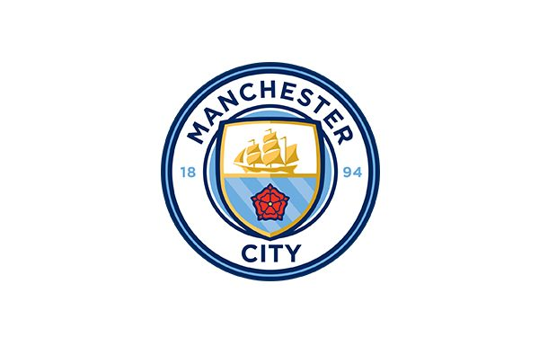

# Edd Webster Junior Data Scientst Data Challenge Submission
This repository is the code submitted by [Edd Webster](https://twitter.com/eddwebster) for the Manchester City F.C. Junior Data Scientst Data Challenge submission, including a list of publicly available resources published by the football analytics community that are related to the project.

  

  

## :wave: About this Repository and Author
Please note, all the work produced in this repository is mine and/or credited to the publicly produced code, data, and/or libraries used, and is in no way related to the work and analysis I produce for my employers.

For more information about this repository and the author, I am available through all the following channels:
*    [eddwebster.com](https://www.eddwebster.com/);
*    edd.j.webster@gmail.com;
*    [@eddwebster](https://www.twitter.com/eddwebster);
*    [linkedin.com/in/eddwebster](https://www.linkedin.com/in/eddwebster/);
*    [github/eddwebster](https://github.com/eddwebster/); and
*    [public.tableau.com/profile/edd.webster](https://public.tableau.com/profile/edd.webster).

## Contents:
*    [Notebooks](#notebooks)
*    [Data Sources](#data--sources)
*    [Tutorials](#tutorials)
*    [Libaries and GitHub Repositories](#libraries)
*    [Written Pieces](#written--pieces)
*    [Videos](#videos)
*    [Books](#books)
*    [Podcasts](#podcasts)

## :notebook_with_decorative_cover: Notebooks
For code used to produce the Chance Quality Model and game two of the Metrica Sports sample data, see the [notebooks](https://github.com/eddwebster/mcfc_submission/tree/master/notebooks) subfolder, in which the workflow is divided into the following:
*    [Shots](https://github.com/eddwebster/football_analytics/tree/master/notebooks/shots) - the Chance Quality Model that calculates the probability of a shot resulting in a goal; and
*    [Metrica Sports](https://github.com/eddwebster/football_analytics/tree/master/notebooks/metrica-sports) - analysis of the major chances that each team created during game 2, using the Chance Quality Model developed from the shots data.

## :floppy_disk: Data Sources

### Data sources used
Due to the 100mb file size limitation in GitHub, all engineered datasets prepared in this repository have been exported and made publicly available to view and download in Google Drive. Please see the following [[link](https://drive.google.com/drive/folders/1r2Rf3CPsKnxyxtmDRIHQ2eoW5WwCzBa0?usp=sharing)]. However, all code in this repository should enable you to scrape, parse, and engineer the datasets to the format in which I have analysed and visualised the data in this repo.
*    The provided sample of shots data; and
*    [Metrica Sports Sample Tracking and corresponding Event data](https://github.com/metrica-sports/sample-data). For code to work with this data, see the  [`LaurieOnTracking`](https://github.com/Friends-of-Tracking-Data-FoTD/LaurieOnTracking) GitHub repo by [Laurie Shaw](https://twitter.com/EightyFivePoint) and the corresponding Friends of Tracking tutorials;

### Documentation
All documentation saved locally in the [documentation](https://github.com/eddwebster/mcfc_submission/tree/master/documentation) subfolder, including:
*    Provided notes and definitions for the a sample of shots [[link](https://github.com/eddwebster/mcfc_submission/blob/main/documentation/shots/ShotData.txt)]; and
*    [Metrica Sports event definitions](https://github.com/metrica-sports/sample-data/blob/master/documentation/events-definitions.pdf).

## :student: Tutorials
*    Friends of Tracking YouTube channel [[link](https://www.youtube.com/channel/UCUBFJYcag8j2rm_9HkrrA7w)] and Mathematical Modelling of Football course by Uppsala University [[link](https://uppsala.instructure.com/courses/28112)]. The GitHub repo with all code featured can be found at the following [[link](https://github.com/Friends-of-Tracking-Data-FoTD)]. Lectures of note include:
     +    Laurie Shaw's Metrica Sports Tracking data series for #FoT - [Introduction](https://www.youtube.com/watch?v=8TrleFklEsE), [Measuring Physical Performance](https://www.youtube.com/watch?v=VX3T-4lB2o0), [Pitch Control modelling](https://www.youtube.com/watch?v=5X1cSehLg6s), and [Valuing Actions](https://www.youtube.com/watch?v=KXSLKwADXKI). See the following for code [[link](https://github.com/Friends-of-Tracking-Data-FoTD/LaurieOnTracking)];
     +    David Sumpter's Expected Goals webinars for #FoT - [How to Build An Expected Goals Model 1: Data and Model](https://www.youtube.com/watch?v=bpjLyFyLlXs), [How to Build An Expected Goals Model 2: Statistical fitting](https://www.youtube.com/watch?v=wHOgINJ5g54), and [The Ultimate Guide to Expected Goals](https://www.youtube.com/watch?v=310_eW0hUqQ). See the following for code [3xGModel](https://github.com/Friends-of-Tracking-Data-FoTD/SoccermaticsForPython/blob/master/3xGModel.py), [4LinearRegression](https://github.com/Friends-of-Tracking-Data-FoTD/SoccermaticsForPython/blob/master/4LinearRegression.py), [5xGModelFit.py](https://github.com/Friends-of-Tracking-Data-FoTD/SoccermaticsForPython/blob/master/5xGModelFit.py), and [6MeasuresOfFit](https://github.com/Friends-of-Tracking-Data-FoTD/SoccermaticsForPython/blob/master/6MeasuresOfFit.py);
     +    Peter McKeever's ['Good practice in data visualisation'](https://www.youtube.com/watch?v=md0pdsWtq_o) webinar for #FoT. See the following for code [[link](https://github.com/petermckeeverPerform/friends-of-tracking-viz-lecture)];
*    [Soccer Analytics Handbook](https://github.com/devinpleuler/analytics-handbook) by [Devin Pleuler](https://twitter.com/devinpleuler). See tutorial notebooks (also available in Google Colab) that notably include: [3. Logistic Regression](https://github.com/devinpleuler/analytics-handbook/blob/master/notebooks/logistic_regression.ipynb), and [7. Data Visualization](https://github.com/devinpleuler/analytics-handbook/blob/master/notebooks/data_visualization.ipynb):
*    [FC Python](https://twitter.com/fc_python) tutorials [[link](https://fcpython.com/)];
*    DataViz, Python, and matplotlib tutorials by Peter McKeever [[link](http://petermckeever.com/)] - I think his website is currently in redevelopment, with many of the old tutorials not currently available (28/02/2021). Check out his revamped [How to Draw a Football Pitch](http://petermckeever.com/2020/10/how-to-draw-a-football-pitch/) tutorial;
*    [McKay Johns YouTube channel](https://www.youtube.com/channel/UCmqincDKps3syxvD4hbODSg);
*    [soccer_analytics GitHub repo](https://github.com/CleKraus/soccer_analytics) by CleKraus - a Python project that facilitates the starting point for analytics;
*    [Python for Fantasy Football series](http://www.fantasyfutopia.com/python-for-fantasy-football-introduction/) by [Fantasy Futopia](https://twitter.com/FantasyFutopia) ([Thomas Whelan](https://twitter.com/tom_whelan)). This series covers the basics of working with data in Python, working with APIs and parsing StatsBomb JSON data, scraping data using Beautifulsoup and Selenium, and Machine Learning with scikit-learn and XGBoost,  See GitHub repo for all code [[link](https://github.com/twhelan22/python-for-fantasy-football)]; and
*    [Tech how-to: build your own Expected Goals model](https://www.scisports.com/tech-how-to-build-your-own-expected-goals-model/) by Jan Van Haaren and SciSports.

## :classical_building: Libaries
*    [`mplsoccer`](https://github.com/andrewRowlinson/mplsoccer) - a Python library for drawing soccer/football pitches in Matplotlib and loading StatsBomb open-data by [Andrew Rowlinson](https://twitter.com/numberstorm);
*    [`Friends-of-Tracking-Data-FoTD`](https://github.com/Friends-of-Tracking-Data-FoTD);
*    [`SoccermaticsForPython`](https://github.com/Friends-of-Tracking-Data-FoTD/SoccermaticsForPython) - repo by David Sumpter dedicated for people getting started with Python using the concepts derived from the book Soccermatics 
*    [`LaurieOnTracking`](https://github.com/Friends-of-Tracking-Data-FoTD/LaurieOnTracking) by [Laurie Shaw](https://twitter.com/EightyFivePoint) - Python code for working with Metrica tracking data; and
*    [`Expected Goals Thesis`](https://github.com/andrewRowlinson/expected-goals-thesis) by [Andrew Rowlinson](https://twitter.com/numberstorm).

## :books: Written Pieces
For a full list of Expected Goals literature, see the following [[link](https://docs.google.com/document/d/1OY0dxqXIBgncj0UDgb97zOtczC-b6JUknPFWgD77ng4/edit)].

### Papers
The following Shiny App from Lars Maurath is a great tool for looking up publications [[link](https://larsmaurath.shinyapps.io/soccer-analytics-library/)].
*    [Routine Inspection: A Playbook for Corner Kicks](https://www.springerprofessional.de/en/routine-inspection-a-playbook-for-corner-kicks/18671052) (2020) by [Laurie Shaw](https://twitter.com/EightyFivePoint) and Sudarshan 'Suds' Gopaladesikan.  Accompanying talk - [2020 Harvard Sports Analytics Lab](https://www.youtube.com/watch?v=yfPC1O_g-I8)]; and
*    [Dynamic Analysis of Team Strategy in Professional Football](https://static.capabiliaserver.com/frontend/clients/barca/wp_prod/wp-content/uploads/2020/01/56ce723e-barca-conference-paper-laurie-shaw.pdf) (2019) by [Laurie Shaw](https://twitter.com/EightyFivePoint) and [Mark Glickman](https://twitter.com/glicko). Accompanying talks - [NESSIS 2019](https://www.youtube.com/watch?v=VU4BOu6VfbU), [2020 Google Sports Analytics Meetup](https://www.youtube.com/watch?v=aQ9L6IkWI8U).

### Blogs
*    [Sam Green's xG model](https://www.optasportspro.com/news-analysis/assessing-the-performance-of-premier-league-goalscorers/);
*    [Michael Caley's xG model](https://cartilagefreecaptain.sbnation.com/2014/9/11/6131661/premier-league-projections-2014#methoderology);
*    [Using Data to Analyse Team Formations](https://eightyfivepoints.blogspot.com/2019/11/using-data-to-analyse-team-formations.html) by [Laurie Shaw](https://twitter.com/EightyFivePoint);
*    [Structure in football: putting formations into context](https://eightyfivepoints.blogspot.com/2020/12/structure-in-football-putting.html) by [Laurie Shaw](https://twitter.com/EightyFivePoint);
*    [xG explained](https://fbref.com/en/expected-goals-model-explained/) by FBref; 
*    [Should you write about real goals or expected goals? A guide for journalists](https://soccermatics.medium.com/should-you-write-about-real-goals-or-expected-goals-a-guide-for-journalists-2cf0c7ec6bb6) by David Sumpter;
*    [How Data Availability affects the ability to learn good xG models](https://dtai.cs.kuleuven.be/sports/blog/how-data-availability-affects-the-ability-to-learn-good-xg-models/) by Jesse Davis and Pieter Robberechts for KU Leuven;
*    [Expected Goals and Unexpected Goals](https://web.archive.org/web/20200724125157/http://business-analytic.co.uk/blog/expected-goals-and-unexpected-goals/) by Garry Gelade;
*    [Assessing Expected Goals Models. Part 1: Shots](https://web.archive.org/web/20200724125157/http://business-analytic.co.uk/blog/evaluating-expected-goals-models/) by Garry Gelade; and
*    [Assessing Expected Goals Models. Part 2: Anatomy of a Big Chance](https://web.archive.org/web/20200724125157/http://business-analytic.co.uk/blog/assessing-expected-goals-models-part-2-anatomy-of-a-big-chance/) by Garry Gelade.

### :newspaper: News Articles
*    [Liverpool sign up for StatsBomb 360: Ted Knutson explains why this stats revolution will change the game](https://www.skysports.com/football/news/11669/12248621/liverpool-sign-up-for-statsbomb-360-ted-knutson-explains-why-this-stats-revolution-will-change-the-game) (18/03/2021) by Adam Bate for Sky Sports News; and
*    [Man City’s Big Winter Signing Is a Former Hedge Fund Brain](https://www.bloombergquint.com/markets/man-city-s-big-winter-signing-is-a-former-hedge-fund-brain) (31/01/2021) by David Dellier and Adam Blenford for Bloomberg.

## :vhs: Videos
For a YouTube playlist of over 800 Sports Analytics / Data Science videos that I have collated into one single playlist, originally for my own viewing but it may be useful to you, see [[link](https://www.youtube.com/watch?v=lLcXH_4rwr4&list=PL38nJNjpNpH9OSeTgnnVeKkzHsQUJDb70&ab_channel=FourFourTwo)]. For Football-specific Data Science lectures and seminars, see [[link](https://www.youtube.com/playlist?list=PL38nJNjpNpH-l59NupDBW7oG7CmWBgp7Y)]. For a Tableau Football specific playlist, see [[link](https://www.youtube.com/watch?v=Rx7FWugmBC4&list=PL38nJNjpNpH__B0QzZ3BA0B3AxGzt0FAl&ab_channel=TableauSoftware)].

### Webinars and Lectures
*    Laurie Shaw's Metrica Sports Tracking data series for #FoT - [Introduction](https://www.youtube.com/watch?v=8TrleFklEsE), [Measuring Physical Performance](https://www.youtube.com/watch?v=VX3T-4lB2o0), [Pitch Control modelling](https://www.youtube.com/watch?v=5X1cSehLg6s), and [Valuing Actions](https://www.youtube.com/watch?v=KXSLKwADXKI). See the following for code [[link](https://github.com/Friends-of-Tracking-Data-FoTD/LaurieOnTracking)];
*    David Sumpter's Expected Goals webinars for #FoT - [How to Build An Expected Goals Model 1: Data and Model](https://www.youtube.com/watch?v=bpjLyFyLlXs), [How to Build An Expected Goals Model 2: Statistical fitting](https://www.youtube.com/watch?v=wHOgINJ5g54), and [The Ultimate Guide to Expected Goals](https://www.youtube.com/watch?v=310_eW0hUqQ). See the following for code [3xGModel](https://github.com/Friends-of-Tracking-Data-FoTD/SoccermaticsForPython/blob/master/3xGModel.py), [4LinearRegression](https://github.com/Friends-of-Tracking-Data-FoTD/SoccermaticsForPython/blob/master/4LinearRegression.py), [5xGModelFit.py](https://github.com/Friends-of-Tracking-Data-FoTD/SoccermaticsForPython/blob/master/5xGModelFit.py), and [6MeasuresOfFit](https://github.com/Friends-of-Tracking-Data-FoTD/SoccermaticsForPython/blob/master/6MeasuresOfFit.py);
*    Peter McKeever's ['Good practice in data visualisation'](https://www.youtube.com/watch?v=md0pdsWtq_o) webinar for #FoT. See the following for code [[link](https://github.com/petermckeeverPerform/friends-of-tracking-viz-lecture)];
*    The Ultimate Guide to Expected Goals by David Sumpter (@Soccermatics) (Hammarby) for Friends of Tracking: https://www.youtube.com/watch?v=310_eW0hUqQ
*    How to explain Expected Goals to a football player by David Sumpter (@Soccermatics): https://www.youtube.com/watch?v=Xc6IG9-Dt18
*    What is xG? by Alex Stewart for Tifo Football: https://www.youtube.com/watch?v=zSaeaFcm1SY
*    Opta Expected Goals presented by Duncan Alexander (@oilysailor): https://www.youtube.com/watch?v=w7zPZsLGK18
*    Sam Green OptaPro Interview: https://www.youtube.com/watch?v=gHIY-MgDh_o
*    Anatomy of a Goal (with Sam Green) for Numberphile: https://www.youtube.com/watch?v=YJuHC7xXsGA
*    [Will Spearman's masterclass in Pitch Control](https://www.youtube.com/watch?v=X9PrwPyolyU&list=PL38nJNjpNpH-l59NupDBW7oG7CmWBgp7Y)] for Friends of Tracking; and
*    [How Tracking Data is Used in Football and What are the Future Challenges](https://www.youtube.com/watch?v=kHTq9cwdkGA) with Javier Fernández, Sudarshan 'Suds' Gopaladesikan, Laurie Shaw, Will Spearman and David Sumpter for Friends of Tracking.

### Miscellaneous
*    [Jeff Stelling xG rant](https://facebook.com/SoccerAM/videos/1740454985978128/); and
*    [Craig Burley xG rant](https://www.youtube.com/watch?v=JBWKGij9Y5A).

## :tv: YouTube Channels
*    [Friends of Tracking](https://www.youtube.com/channel/UCUBFJYcag8j2rm_9HkrrA7w) with [David Sumpter](https://twitter.com/Soccermatics), [Javier Fernández](https://twitter.com/JaviOnData), [Laurie Shaw](https://twitter.com/EightyFivePoint), [Sudarshan 'Suds' Gopaladesikan](https://twitter.com/suds_g), [Pascal Bauer](https://twitter.com/pascal_bauer), and [Fran Peralta](https://twitter.com/PeraltaFran23);
*    [McKay Johns](https://www.youtube.com/channel/UCmqincDKps3syxvD4hbODSg);
*    [Mark Glickman](https://www.youtube.com/channel/UC-gtC2WYRAr_4eYRIUb4ovg) – for NESSIS talks, uploaded to his personal channel. Old talks are available on his [Metacafe channel](https://www.metacafe.com/channels/Mark%20Glickman/). See the official website [[link](http://www.nessis.org/)];
*    [42 Analytics](https://www.youtube.com/user/42analytics) – for SSAC conferences;
*    [StatsBomb](https://www.youtube.com/channel/UCmZ2ArreL9muPvH49Gaw0Bw);
*    [Opta](https://www.youtube.com/user/optasports) - including Opta Pro Forum talks; and
*    [Tifo Football](https://www.youtube.com/channel/UCGYYNGmyhZ_kwBF_lqqXdAQ).

## :books: Books
*    [The Numbers Game](https://www.amazon.co.uk/Numbers-Game-Everything-About-Football/) by [Chris Anderson](https://twitter.com/soccerquant) and [David Sally](https://twitter.com/DavidSally6);
*    [Football Hackers](https://www.amazon.co.uk/Football-Hackers-Science-Data-Revolution/) by [Christoph Biermann](https://twitter.com/chbiermann);
*    [Soccermatics](https://www.amazon.co.uk/Soccermatics-Mathematical-Adventures-Pro-Bloomsbury/dp/1472924142/ref=tmm_pap_swatch_0?_encoding=UTF8&qid=&sr=) by [David Sumpter](https://twitter.com/Soccermatics);
*    [Soccernomics](https://www.amazon.co.uk/Soccernomics-England-Germany-France-Finally/) by Simon Kuper and [Stefan Szymanski](https://twitter.com/sszy);
*    [Money and Football: A Soccernomics Guide ](https://www.amazon.co.uk/dp/B06XCKCVQR/) by Simon Kuper and [Stefan Szymanski](https://twitter.com/sszy); and
*    [Data Analytics in Football](https://www.amazon.co.uk/Data-Analytics-Football-Daniel-Memmert/) by [Daniel Memmert](https://twitter.com/DMemmert) and Dominik Raabe.

## :loud_sound: Podcasts 
List of notable episodes:
*    [All Stats Aren't We](https://open.spotify.com/show/22eR0UCjDdVXY2JTtjD3OI?si=kt_lY1m2QKukOvKvmWpsPA):
     +    [Bonus Episode: David Sumpter - The Ten Equations that Rule the World](https://open.spotify.com/episode/2aWNiGHVH29qnXdrw12Iet?si=gU5__QfvRsCCxjE7XjcRhQ)
*    [Analytics FC Podcast](https://analyticsfc.co.uk/podcast/):
     +    [Episode 27: David Sumpter](https://open.spotify.com/episode/6gG4VY5hRlIio0smhgTnWh?si=meS7GqPxR4WXf2PGMPATZw)
*    [The Conor J Show](https://open.spotify.com/show/2VeRpUoHzC7KN9zxB5N2iz?si=oSMPSpwbR7-IgxSzqlk6Ig):
     +    [The Role Mathematics plays in Sports and Politics (Part 1) | David Sumpter | TCJS #11 (1/2)](https://open.spotify.com/episode/7BBAToNN9Mt0Ol8c9bDtGS?si=5YNtRObXQMu7xYBEgLgmbQ)
*    [Expected Value](https://open.spotify.com/show/5xFeWbaaLFepY5n73SfWwr?si=yn23mqUpQa-mvcL6CYWpgA)
     +    [NESSIS, Part 1 - Ron Yurko & Dani Chu](https://open.spotify.com/episode/3pRxs7LYPX4LP9jGcFXudz?si=V7G5JpJxRZiMhqlPwblrWQ)
     +    [NESSIS, Part 2 - Laurie Shaw & Sam Gregory](https://open.spotify.com/episode/42z1UFcfgpx17acCCg5rip?si=Pyu8gFJxRiej9fE15Gs89A)
*    [The Football Collective Podcast](https://open.spotify.com/show/3fqNuhWi6hkagJ1U0UDJfe?si=e10JT2ACS86A3JXyO1AzGQ):
     +    [S3 E1 | Sarthak Mondal speaks to Laurie Shaw about the advent of Data Science in Football The Football Collective Podcast](https://open.spotify.com/episode/1gJXuovD1L6VMimN5BtukS?si=Y-Ot43T8TluU7UEiSvReyg)
*    [The Football Pod](https://open.spotify.com/show/3QhwCTOvJN3AZqNalgjtnO?si=173ZCWfsTs-jktoS7Bz9XQ):
     +    [Episode 3 with David Sumpter](https://open.spotify.com/episode/4mnDHbUo097JuC2lQiFijo?si=7abgc4_vRM21jSKff04rWg)
*    [Football Today](https://open.spotify.com/show/1WRaXZgVlksph0IjsTNBaG?si=0zyUX59sTKqCRnq92SEylQ&nd=1)
     +    [Manchester City Enters Data Arms Race With Liverpool](https://open.spotify.com/episode/311rLza8goz2b2SBORBORn?si=aqZX6ooOSfGkY3312jJozA)
*    [Pinnacle Podcast](https://open.spotify.com/show/091oYrS0glFhP81fq32bpE?si=TmR79XGnRAm5987Zj33ImA):
     +    [Serious About Betting: David Sumpter](https://open.spotify.com/episode/6Bt5L7wXDGvrSezYL2FU2O?si=IgQB1TArR9CBTnecZxb6qA)
*    [Squawka Talker Football Podcast](https://open.spotify.com/show/7xqylrPDX54uo01n4erZQZ?si=XpMNQ43aQxKUa6QuB0dp2w):
     +    [BIG interview with David Sumpter: Putting GPS trackers on under 10s football teams](https://open.spotify.com/episode/6c6vOWNhvUah7Mz01oiCgt?si=t7Sc0W8WRUS0ZnVWTaGt0g)
*    [Tifo Podcast](https://open.spotify.com/show/06QIGhqK31Qw1UvfHzRIDA?si=eJzpmtMeSPWUDP9fQ-5pqA):
     +    The Future of Stats: xG, xA - [Spotify](https://open.spotify.com/episode/7fPpKZSt2o9SSNynayROwd?si=WxuV2PFCQ7yRdNSE-QOZ6g) and [YouTube](https://www.youtube.com/watch?v=sNCeA27sDvI)
*    [Trademate Sports](https://open.spotify.com/show/2LPzUrtsWvz5iSayEGeEQK?si=prrlKqiwQ7-bKIUtbemkeQ):
     +    [Ep 87: Mathematics Professor David Sumpter & Trademate CEO Marius Norheim - Using Mathematics in...](https://open.spotify.com/episode/6jYhTHxujga5D9j37uQbLt?si=3gwKy27dRcOgVij5bYpGzA)
*    [UCN/USF Sport Management - Sports Business Podcast](https://soundcloud.com/user-736114890):
     +    [Kenneth Cortsen talks to Laurie Shaw from Harvard University](https://soundcloud.com/user-736114890/sport-data-analytics-in-football-kenneth-cortsen-talks-to-laurie-shaw-harvard-university) 
